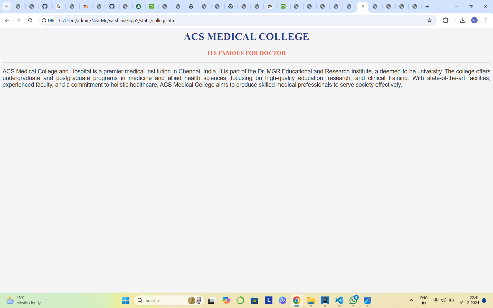
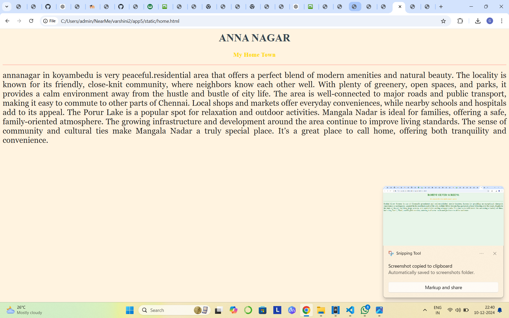
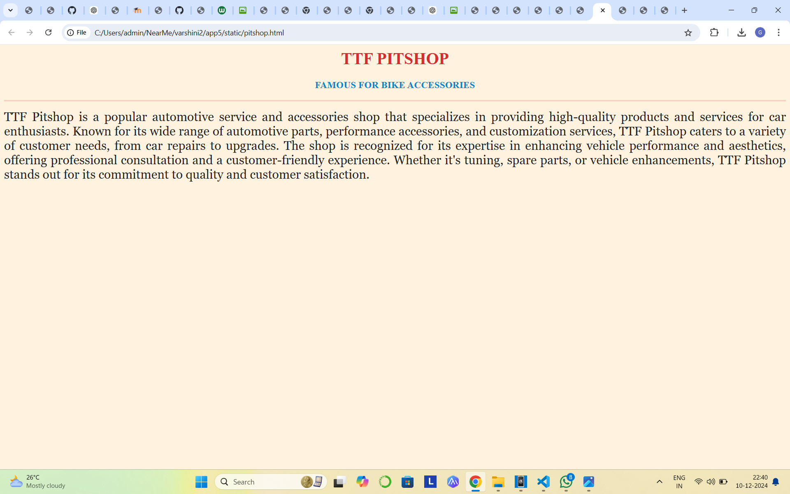
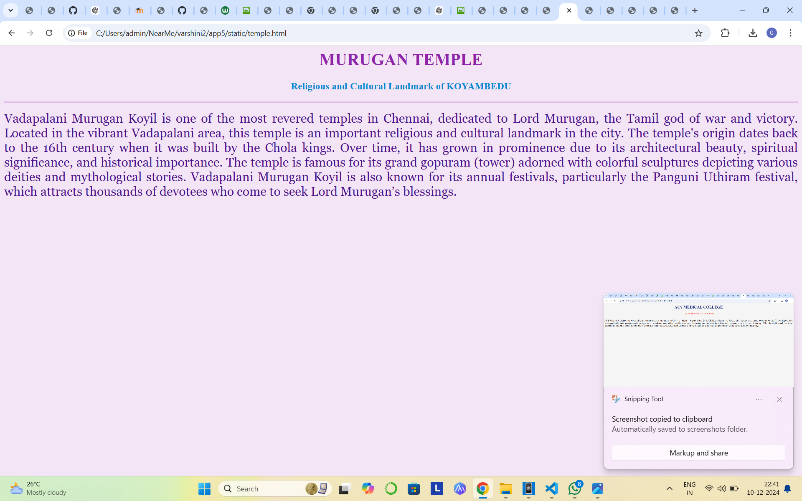

# Ex04 Places Around Me
## Date: 

## AIM
To develop a website to display details about the places around my house.

## DESIGN STEPS

### STEP 1
Create a Django admin interface.

### STEP 2
Download your city map from Google.

### STEP 3
Using ```<map>``` tag name the map.

### STEP 4
Create clickable regions in the image using ```<area>``` tag.

### STEP 5
Write HTML programs for all the regions identified.

### STEP 6
Execute the programs and publish them.

## CODE
MAP.HTML
```

<html>
<head>
<title>My City</title>
</head>
<body>
<h1 align="center">
<font color="Red"><b>KOYAMEDU</b></font>
</h1>
<h3 align="center">
<font color="purple"><b>GEETHAPRIYAN A S(24900874)</b></font>
</h3>
<center>

<map name="MyCity">
    <area target="_blank" alt="rohini theatre" title="rohini theatre" href="theatre.html" coords="1296,464,1077,390" shape="rect">
    <area target="" alt="murugan temple" title="murugan temple" href="temple.html" coords="1433,725,1624,862" shape="rect">
    <area target="_blank" alt="" title="" href="pitshop.html" coords="472,52,663,120" shape="rect">
    <area target="" alt="college" title="college" href="college.html" coords="77,627,296,740" shape="rect">
    <area target="" alt="home" title="home" href="home.html" coords="1414,258,1553,346" shape="rect">
</center>
</body>
</html>


```
HOME.HTML
```
<html>
<head>
<title>My Home Town</title>
</head>
<body bgcolor="#fff3e0">
<h1 align="center">
<font color="#36454F"><b>ANNA NAGAR</b></font>
</h1>
<h3 align="center">
<font color="#FFD700"><b>My Home Town</b></font>
</h3>
<hr size="3" color="#ffccbc">
<p align="justify">
<font face="Georgia" size="5" color="#212121">
     annanagar in koyambedu is very peaceful.residential area that offers a perfect blend of modern amenities and natural beauty. The locality is known for its friendly, close-knit community, where neighbors know each other well. With plenty of greenery, open spaces, and parks, it provides a calm environment away from the hustle and bustle of city life. The area is well-connected to major roads and public transport, making it easy to commute to other parts of Chennai. Local shops and markets offer everyday conveniences, while nearby schools and hospitals add to its appeal. The Porur Lake is a popular spot for relaxation and outdoor activities. Mangala Nadar is ideal for families, offering a safe, family-oriented atmosphere. The growing infrastructure and development around the area continue to improve living standards. The sense of community and cultural ties make Mangala Nadar a truly special place. It’s a great place to call home, offering both tranquility and convenience.

</font>
</p>
</body>
</html>


```
TEMPLE.HTML

```
<html>
<head>
<title>My Home Town</title>
</head>
<body bgcolor="#f3e5f5">
<h1 align="center">
<font color="#8e24aa"><b>MURUGAN TEMPLE</b></font>
</h1>
<h3 align="center">
<font color="#0288d1"><b>Religious and Cultural Landmark of KOYAMBEDU</b></font>
</h3>
<hr size="3" color="#e1bee7">
<p align="justify">
<font face="Georgia" size="5" color="#4a148c">

    Vadapalani Murugan Koyil is one of the most revered temples in Chennai, dedicated to Lord Murugan, the Tamil god of war and victory. Located in the vibrant Vadapalani area, this temple is an important religious and cultural landmark in the city. The temple's origin dates back to the 16th century when it was built by the Chola kings. Over time, it has grown in prominence due to its architectural beauty, spiritual significance, and historical importance. The temple is famous for its grand gopuram (tower) adorned with colorful sculptures depicting various deities and mythological stories. Vadapalani Murugan Koyil is also known for its annual festivals, particularly the Panguni Uthiram festival, which attracts thousands of devotees who come to seek Lord Murugan’s blessings.
</font>
</p>
</body>
</html>


```
THEATRE.HTML

```
<html>
<head>
<title>My Home Town</title>
</head>
<body bgcolor="#e8f5e9">
<h1 align="center">
<font color="#388e3c"><b>ROHINI SILVER SCREENS</b></font>
</h1>
<h3 align="center">
<font color="#fbc02d"><b>It is famous for actor Ajith kumar's movie</b></font>
</h3>
<hr size="3" color="#a5d6a7">
<p align="justify">
<font face="Georgia" size="5" color="#1b5e20">

    Rohini Silver Screens is one of Chennai's prominent and well-established movie theaters, known for providing an exceptional cinematic experience to moviegoers. Located in the northern part of the city, Rohini Silver Screens has garnered a loyal following over the years, thanks to its state-of-the-art facilities, large screens, and comfortable seating arrangements. The cinema is well known for screening a variety of films, including Tamil, Hindi, and English movies, catering to diverse tastes and preferences of the audience.

</font>
</p>
</body>
</html>


```
PITSHOP.HTML
```
<html>
<head>
<title>My Home Town</title>
</head>
<body bgcolor="#fff3e0">
<h1 align="center">
<font color="#d32f2f"><b>TTF PITSHOP</b></font>
</h1>
<h3 align="center">
<font color="#0288d1"><b>FAMOUS FOR BIKE ACCESSORIES</b></font>
</h3>
<hr size="3" color="#ffccbc">
<p align="justify">
<font face="Georgia" size="5" color="#212121">

    TTF Pitshop is a popular automotive service and accessories shop that specializes in providing high-quality products and services for car enthusiasts. Known for its wide range of automotive parts, performance accessories, and customization services, TTF Pitshop caters to a variety of customer needs, from car repairs to upgrades. The shop is recognized for its expertise in enhancing vehicle performance and aesthetics, offering professional consultation and a customer-friendly experience. Whether it's tuning, spare parts, or vehicle enhancements, TTF Pitshop stands out for its commitment to quality and customer satisfaction.
</font>
</p>
</body>
</html>

```


OUTPUT








## RESULT
The program for implementing image maps using HTML is executed successfully.
